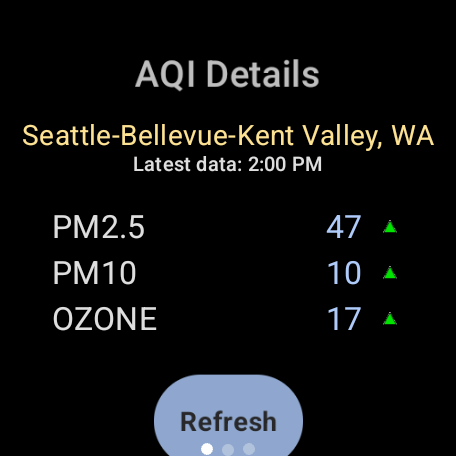

# Gov AQI

A Wear OS watch app and complication that displays real-time air quality data from the EPA's [AirNow.gov](https://www.airnow.gov/).

<p align="center">
  
</p>

## Features

- **Watch face complication** — shows the highest AQI pollutant and value at a glance (SHORT_TEXT and RANGED_VALUE types)
- **Details screen** — displays all pollutant AQI values (PM2.5, PM10, OZONE) with color-coded indicators for your nearest reporting area
- **Automatic location** — finds the closest EPA sensor using device GPS with configurable location caching
- **Background sync** — updates hourly via WorkManager, with manual refresh available

## Architecture

```
EPA AirNow (reportingarea.dat)
        │
        ▼
Cloudflare Worker (cron every 15 min)
        │
        ▼
    R2 Storage (all_data.json)
        │
        ▼
   Wear OS App
```

The Cloudflare Worker fetches EPA data, normalizes timestamps to UTC epoch seconds, and stores a single JSON file in R2. The watch app fetches this file, selects the nearest sensor, and displays the data.

## Setup

### Worker

1. `cd worker`
2. `cp wrangler.toml.example wrangler.toml` and configure your R2 bucket
3. `npx wrangler secret put API_SECRET` — set a shared secret for request authentication
4. `npx wrangler deploy`

### Watch App

1. `cd watch`
2. Add your secret to `local.properties`:
   ```
   api.secret=your_secret_here
   ```
3. Update `AQI_BASE_URL` in `app/build.gradle.kts` to point to your worker
4. `./gradlew assembleRelease`
5. `adb install app/build/outputs/apk/release/app-release.apk`

## Data Coverage

Covers approximately 80% of the US and select international cities, depending on EPA AirNow reporting area availability.

## License

MIT
